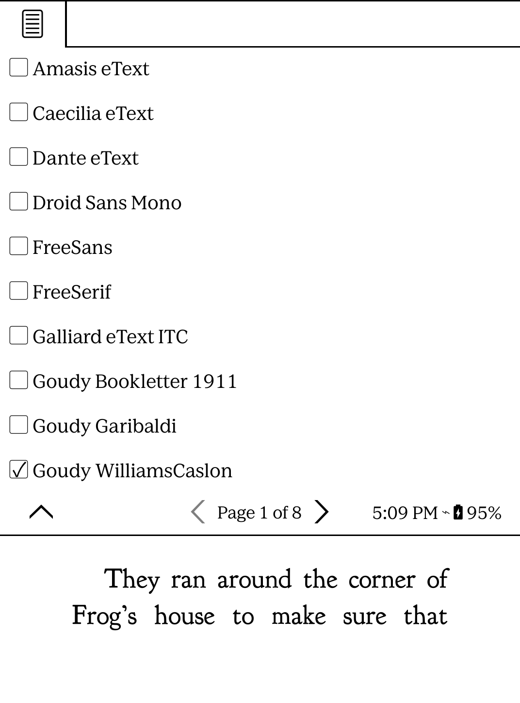

# Font Switcher Plugin for KOReader

A lightweight and powerful plugin for KOReader that allows you to quickly cycle through your system fonts using gestures or a dedicated menu in the Typeset tab. Designed specifically for reflowable documents (EPUB, FB2, etc.).

## Features

- **Gesture Support:** 
  - Assign gestures (swipes, taps, corners) to **Next Font**, **Previous Font**, or **Open Font List**.
  - Accessible under the **General** category in the Gesture Manager.

- **Menu Integration:**
  - Adds a "Font Switcher" entry directly into the **Gereral** tab in the Top Menu for quick access.

- **Interactive Font List:**
  - View all available system fonts in a clean, scrollable list.
  - Currently active font is automatically highlighted with a checkmark.
  - Native look and feel using standard KOReader UI components.

- **Intelligent Detection:**
  - Automatically identifies if a document is reflowable and supports font switching.
  - Provides helpful feedback if used on non-reflowable documents (like PDFs).

## Installation

### On Kobo, Kindle, etc.

1. Connect your device to your computer via USB.
2. Navigate to the KOReader plugins directory:
   - **Kobo:** `.adds/koreader/plugins/`
   - **Kindle:** `koreader/plugins/`
3. Create a new folder named `fontswitcher.koplugin`.
4. Copy the following files into that folder:
   - `main.lua`
   - `_meta.lua`
   - `README.md`
5. Eject your device safely and restart KOReader.

## Usage

### 1. Assigning Gestures
- Open the Top Menu -> **Settings (Gears icon)** -> **Tap and gestures**.
- Go to **Gesture manager**.
- Choose a gesture (e.g., *Two-finger swipe up*).
- Select the **General** category.
- Find and tap **Font Switcher: Next Font** or **Font Switcher: Font List**.

### 2. Using the Top Menu
- Open any EPUB/reflowable book.
- Tap the top of the screen to show the menu.
- Select the **Typeset (A icon)** tab.
- Tap **Font Switcher** to access Next/Previous controls and the full list.

## Technical Details

- **Author:** right9code
- **Version:** 1.0
- **Compatibility:** Works with all reflowable documents supported by the CreEngine (EPUB, FB2, etc.) and documents providing a `setFontFace` method.
- **Icons:** Uses native `appbar.typeset` and `appbar.textsize` icons for a seamless integrated look.
